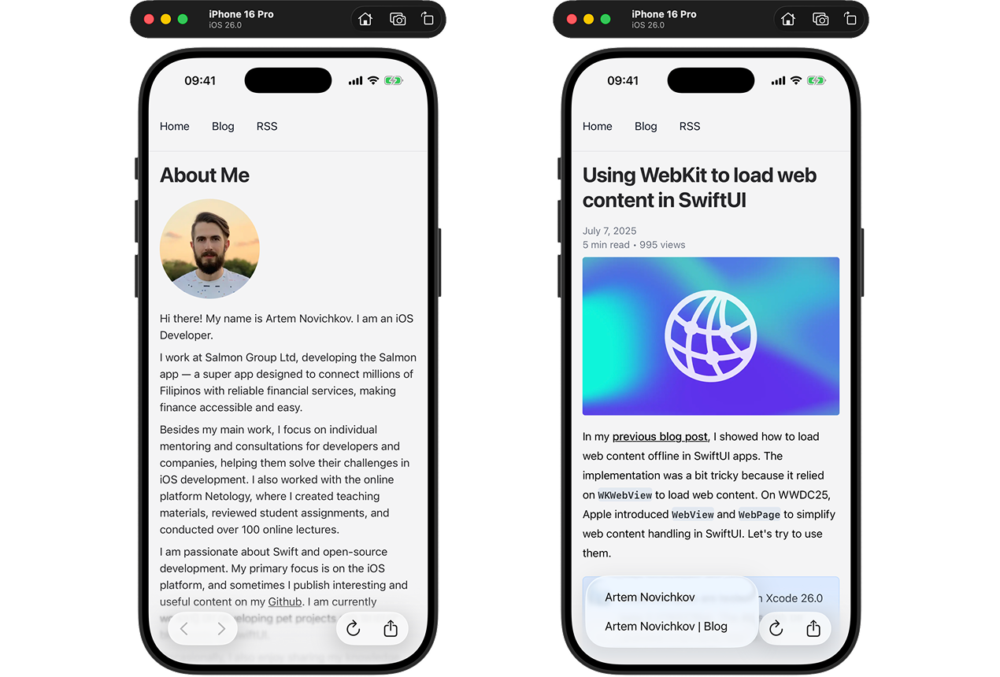

# WebViewNavigationExample

An example project for [Handling WebView navigation in SwiftUI](https://www.artemnovichkov.com/blog/handling-webview-navigation-in-swiftui) blog post.

  

## Author

Artem Novichkov, https://www.artemnovichkov.com/

## License

The project is available under the MIT license. See the [LICENSE](./LICENSE) file for more info.

